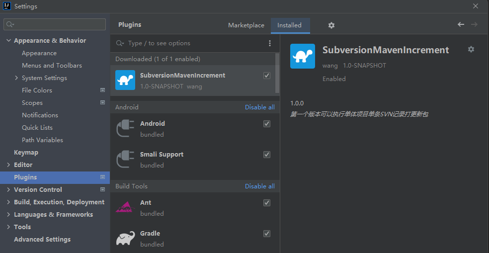
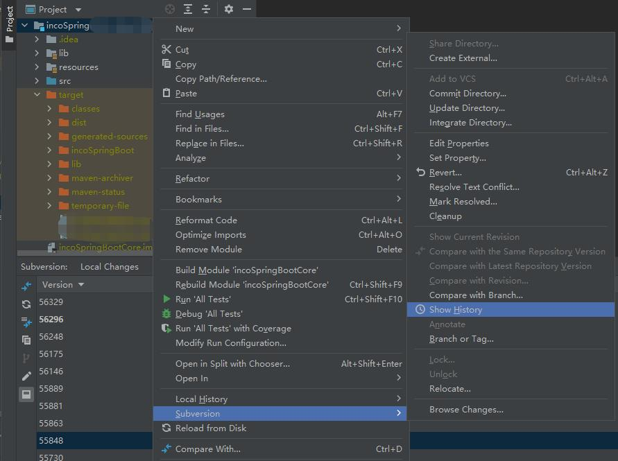
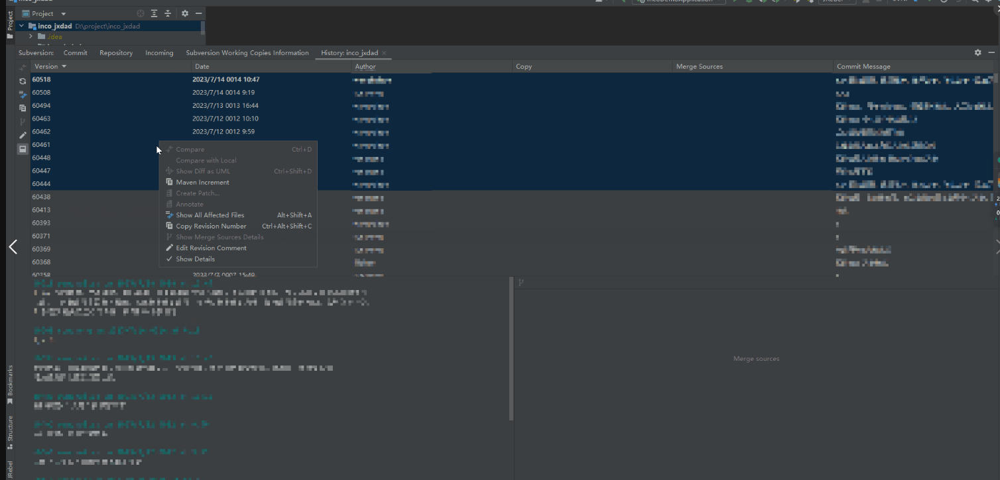
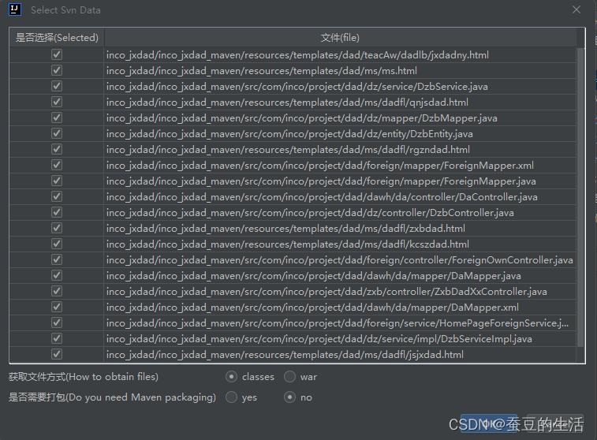
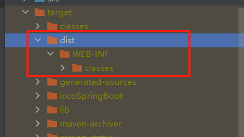

# Subversion Maven Increment

## 简介

Subversion Maven Increment是基于老项目单体 maven+war包项目 打升级包，可以根据SVN提交的记录自动打出升级包

可以在idea商店搜索SubversionMavenIncrement下载

## 依赖
_**本插件需要依赖 SVN和MAVEN**_

_**需要当前电脑安装了 SVN和MAVEN 并且配置了环境变量**_``

## 使用说明
点击 Subversion -> Show History -> Maven Increment
### 步骤1

### 步骤2

### 步骤3
点击 Maven Increment

会弹出选择svn数据生成的窗口，点击确定开始打包

说明：打包开始后会异步打包，打包完成后会提示打包完成，在 target/dist 文件夹下生成打包好的更新包

